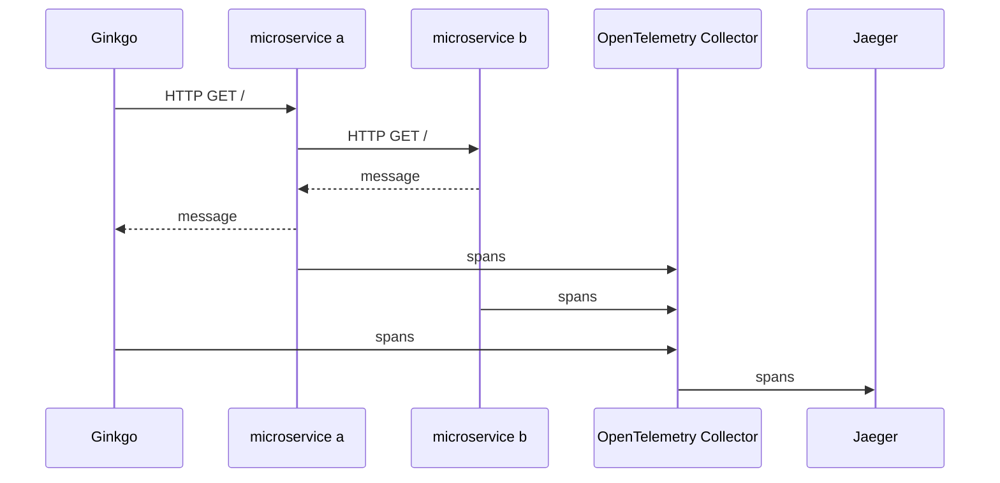

Testing distributed services is hard. Troubleshooting test failures is challenging when the failure isn't from the immediate service under test, but from another dependent service.

One way to ease troubleshooting test failures is by using tracing. Tracing can help see the flow of requests between tests and services. This process works for services created in the same repository as the tests and can work with external services.

Tracing can benefit test cases by tracking which requests are being made by tests, but tracing shines when
the services under test also support tracing.

In this post, we'll:

- setup [OpenTelemetry Collector](https://opentelemetry.io/docs/collector/) and [Jaeger all-in-one](https://www.jaegertracing.io/docs/1.6/getting-started/) for collecting and viewing traces
- create a microservice, named `microservice-a`, that makes an HTTP request to another microservice, `microservice-b`
- create another microservice, named `microservice-b`, that randomly returns a message or an error
- create a Ginkgo test suite that makes an HTTP request to `microservice-a`

The microservices and Ginkgo will all publish spans using the [OpenTelemetry SDK](https://opentelemetry.io/docs/languages/go/getting-started/) to the OpenTelemetry Collector, which will then send the spans to Jaeger for viewing.

> Note: a trace is a collection of related spans

Here's a diagram of what this final flow will look like:



Here is an example of what a failing trace looks like:


Feel free to skip to [Create Ginkgo suite with TracerProvider set up](#create-ginkgo-suite-with-tracerprovider-set-up) if you want to jump straight to the Ginkgo test suite with tracing.

## Set up tracing provider and propagator

We'll create a couple of functions to create a propagator and tracer provider. The functions will be used by both microservices and Ginkgo.

The propagator will enable the attachment and extraction OpenTelemetry headers from HTTP requests to create connected spans across services.
The tracing provider will export spans to the OpenTelemetry Collector listening on port 44317.

Create a new directory named `internal` by running:

```bash
mkdir internal
```

Then, create a new file named `internal/tracing.go` with the following content:

```go
package internal

import (
	"context"
	"fmt"

	"go.opentelemetry.io/otel/exporters/otlp/otlptrace/otlptracegrpc"
	"go.opentelemetry.io/otel/propagation"
	"go.opentelemetry.io/otel/sdk/resource"
	sdktrace "go.opentelemetry.io/otel/sdk/trace"
	semconv "go.opentelemetry.io/otel/semconv/v1.26.0"
)

func GetPropagator() propagation.TextMapPropagator {
	return propagation.NewCompositeTextMapPropagator(
		propagation.TraceContext{},
		propagation.Baggage{},
	)
}

func GetTracerProvider(serviceName string) (*sdktrace.TracerProvider, error) {
	resource := resource.NewWithAttributes(
		semconv.SchemaURL,
		semconv.ServiceName(serviceName),
	)

	exporter, err := otlptracegrpc.New(
		context.Background(),
		otlptracegrpc.WithEndpoint("localhost:44317"),
		otlptracegrpc.WithInsecure(),
	)
	if err != nil {
		return nil, fmt.Errorf("failed to create exporter: %w", err)
	}

	tracerProvider := sdktrace.NewTracerProvider(
		sdktrace.WithBatcher(
			exporter,
		),
		sdktrace.WithResource(resource),
	)

	return tracerProvider, nil
}
```

The above code has two functions. `GetPropagator` will enable OpenTelemetry's trace state and trace flags to be attached and extracted from HTTP headers. `GetTracerProvider` creates a tracer provider that exports spans to the OpenTelemetry Collector running a gRPC server on `localhost:44317` without TLS enabled.

## Create microservices that publish spans

We won't dive too much into what these microservices are doing. They mostly exist,
so we have examples to test via Ginkgo. The main thing to note is that `microservice-a` makes
a request to `microservice-b`. `microservice-b` returns a message, and `microservice-a` wraps that
reponse and returns another response. `microservice-b` will randomly return an error so that
we can see errors within Ginkgo tests.

Let's create our first microservice, `microservice-a`, that will make an HTTP request to `microservice-b` and return a message wrapping the message from `microservice-b`.

Create a `cmd/microservice-a` directory via:

```bash
mkdir -p cmd/microservice-a
```

Create `cmd/microservice-a/main.go` file with the following content:

```go
package main

import (
	"context"
	"encoding/json"
	"fmt"
	"log"
	"net/http"

	"github.com/dustinspecker/ginkgo-gomega-open-telemetry/internal"
	"go.opentelemetry.io/contrib/instrumentation/net/http/otelhttp"
	"go.opentelemetry.io/otel"
)

type Response struct {
	Message string `json:"message"`
}

func getMessage(ctx context.Context) (string, error) {
	url := "http://localhost:8081/"
	jsonMessageResponse, err := otelhttp.Get(ctx, url)
	if err != nil {
		return "", fmt.Errorf("failed to create request: %w", err)
	}
	defer jsonMessageResponse.Body.Close()

	if jsonMessageResponse.StatusCode >= 300 {
		return "", fmt.Errorf("failed request %s: %s", url, jsonMessageResponse.Status)
	}

	response := Response{}
	if err := json.NewDecoder(jsonMessageResponse.Body).Decode(&response); err != nil {
		return "", fmt.Errorf("failed decoding response: %w", err)
	}

	return response.Message, nil
}

func main() {
	tracerProvider, err := internal.GetTracerProvider("microservice-a")
	if err != nil {
		log.Fatalf("failed to get tracer: %v", err)
	}
	// Shutdown tracerProvider at the end of main since log.Fatalf is used
	// when listener stops

	otel.SetTracerProvider(tracerProvider)

	prop := internal.GetPropagator()
	otel.SetTextMapPropagator(prop)

	mux := http.NewServeMux()
	mux.Handle("/", otelhttp.WithRouteTag("/", http.HandlerFunc(func(w http.ResponseWriter, r *http.Request) {
		message, err := getMessage(r.Context())
		if err != nil {
			http.Error(w, err.Error(), http.StatusInternalServerError)
			return
		}

		response := Response{
			Message: fmt.Sprintf("message from microservice-a: %s", message),
		}
		jsonResponse, err := json.Marshal(response)
		if err != nil {
			http.Error(w, err.Error(), http.StatusInternalServerError)
			return
		}

		w.Header().Add("Content-Type", "application/json")
		w.Write(jsonResponse)
	})))

	err = http.ListenAndServe(":8080", otelhttp.NewHandler(mux, "server", otelhttp.WithMessageEvents(otelhttp.ReadEvents, otelhttp.WriteEvents)))

	tracerProvider.Shutdown(context.Background())

	// err should never be nil since ListenAndServe always returns a non-nil error
	if err != nil {
		log.Fatalf("failed to listen and serve: %v", err)
	}
}
```

This code sets up OpenTelemetry tracing, starts a HTTP server listening on port 8080, and requests to `http://localhost:8080` will make a request to `http://localhost:8081/` and return a message wrapping that message.

Let's create the second microservice, `microservice-b`, that will return a message or an error.

Create a `cmd/microservice-b` directory via:

```bash
mkdir -p cmd/microservice-b
```

Create `cmd/microservice-b/main.go` with the following content:

```go
package main

import (
	"context"
	"encoding/json"
	"errors"
	"log"
	"math/rand"
	"net/http"

	"github.com/dustinspecker/ginkgo-gomega-open-telemetry/internal"
	"go.opentelemetry.io/contrib/instrumentation/net/http/otelhttp"
	"go.opentelemetry.io/otel"
	"go.opentelemetry.io/otel/trace"
)

type Response struct {
	Message string `json:"message"`
}

func main() {
	tracerProvider, err := internal.GetTracerProvider("microservice-b")
	if err != nil {
		log.Fatalf("failed to get tracer: %v", err)
	}
	// Shutdown tracerProvider at the end of main since log.Fatalf is used
	// when listener stops

	otel.SetTracerProvider(tracerProvider)

	prop := internal.GetPropagator()
	otel.SetTextMapPropagator(prop)

	mux := http.NewServeMux()

	mux.Handle("/", otelhttp.WithRouteTag("/", http.HandlerFunc(func(w http.ResponseWriter, r *http.Request) {
		if rand.Intn(2) == 1 {
			span := trace.SpanFromContext(r.Context())
			span.RecordError(errors.New("random error"))
			http.Error(w, "Internal Server Error", http.StatusInternalServerError)
			return
		}

		response := Response{
			Message: "Hello, World!",
		}

		jsonResponse, err := json.Marshal(response)
		if err != nil {
			http.Error(w, err.Error(), http.StatusInternalServerError)
			return
		}

		w.Header().Add("Content-Type", "application/json")
		w.Write(jsonResponse)
	})))

	err = http.ListenAndServe(":8081", otelhttp.NewHandler(mux, "server", otelhttp.WithMessageEvents(otelhttp.ReadEvents, otelhttp.WriteEvents)))

	tracerProvider.Shutdown(context.Background())

	// err should never be nil since ListenAndServe always returns a non-nil error
	if err != nil {
		log.Fatalf("failed to listen and serve: %v", err)
	}
}
```

It's very similar to `microservice-a` but will randomly return an error. `microservice-b` will listen on port 8081.

## Setup OpenTelemetry tracing collection

[OpenTelemetry Collector](https://github.com/open-telemetry/opentelemetry-collector) supports several of receivers and exporters to convert different tracing formats. We want
to receive OpenTelemetry traces via gRPC and export them to Jaeger as OpenTelemetry traces via gRPC.

> Note: I'm saying OpenTelemetry Collector, but we're actually using [OpenTelemetry Collector Contrib](https://github.com/open-telemetry/opentelemetry-collector-contrib)
> which has additional receivers and exporters.

OpenTelemetry Collector may seem unnecessary since Jaeger can support OpenTelemetry traces directly, but it's a good example of how to use the it to convert between different tracing formats. In a follow-up post, I'll show how to publish metric data to Prometheus,
which will be a better use case of OpenTelemetry Collector.

Create a new file named `open-telemetry-config.yaml` with the following content:

```yaml
receivers:
  otlp:
    protocols:
      grpc:
        endpoint: 0.0.0.0:44317

exporters:
  otlp/2:
    endpoint: 0.0.0.0:4317
    tls:
      insecure: true

service:
  pipelines:
    traces:
      receivers:
        - otlp
      exporters:
        - otlp/2
```

This instructs OpenTelemetry Collector to listen on port 44317 for OpenTelemetry traces via gRPC and export them to Jaeger on port 4317.

Now, let's start Jaeger and the OpenTelemetry Collector using Docker containers.

Start Jaeger all-in-one by running the following command in a new terminal:

```bash
docker run \
  --interactive \
  --name jaeger \
  --rm \
  --tty \
  --env COLLECTOR_OTLP_ENABLED=true \
  --publish 0.0.0.0:16686:16686 \
  --publish 0.0.0.0:4317:4317 \
  --publish 0.0.0.0:44317:44317 \
  jaegertracing/all-in-one:1.35
```

Start the OpenTelemetry Collector by running the following command in a new terminal:

```bash
docker run \
  --interactive \
  --name opten-telemetry-collector \
  --network container:jaeger \
  --rm \
  --tty \
  --volume "$PWD/open-telemetry-config.yaml:/open-telemetry-config.yaml" \
  otel/opentelemetry-collector-contrib:0.104.0 --config /open-telemetry-config.yaml
```

Jaeger all-in-one and OpenTelemetry Collector will run in the same network so that the OpenTelemetry Collector can send traces to Jaeger. A few ports will be published as well, so that spans may be pushed to OpenTelemetry Collector and Jaeger's UI is available.

These Docker commands should work regardless of whether you use Docker Desktop.

## Create Ginkgo suite with TracerProvider set up

Let's create a new Ginkgo suite and some example test cases. Start by bootstrapping a Ginkgo suite and example test file via:

```bash
mkdir test
cd test
ginkgo bootstrap
ginkgo generate example
cd ..
```

Let's modify our Ginkgo suite to set up tracing via OpenTelemetry. Modify `./test/test_suite_test.go` to match:

```go
package test_test

import (
	"context"
	"fmt"
	"testing"

	"github.com/dustinspecker/ginkgo-gomega-open-telemetry/internal"
	. "github.com/onsi/ginkgo/v2"
	. "github.com/onsi/gomega"
	"go.opentelemetry.io/otel"
	"go.opentelemetry.io/otel/codes"
	"go.opentelemetry.io/otel/trace"
)

var (
	// Note: test cases should not directly use suiteCtx or suiteSpan
	suiteCtx  context.Context
	suiteSpan trace.Span

	// Note: test cases may create children spans by providing testCtx to tracer.Start
	testCtx context.Context
	// Note: test cases may attach attributes to testSpan if desired through testSpan.SetAttributes
	testSpan trace.Span
)

func TestTest(t *testing.T) {
	RegisterFailHandler(Fail)
	RunSpecs(t, "Test Suite")
}

// setup tracer provider, propagator, and create suite-level span
// each test case will have a child span of the suite-level span
var _ = BeforeSuite(func() {
	tracerProvider, err := internal.GetTracerProvider("test")
	Expect(err).NotTo(HaveOccurred(), "error creating tracer provider")
	DeferCleanup(func() {
		Expect(tracerProvider.Shutdown(context.Background())).To(Succeed(), "error shutting down tracer provider")
	})
	otel.SetTracerProvider(tracerProvider)

	propagator := internal.GetPropagator()
	otel.SetTextMapPropagator(propagator)

	suiteCtx, suiteSpan = tracerProvider.Tracer("test").Start(context.Background(), "test-suite")
	DeferCleanup(func() {
		suiteSpan.End()
	})
})

// create a span for the test case
var _ = BeforeEach(func() {
	testCtx, testSpan = otel.GetTracerProvider().Tracer("test").Start(suiteCtx, CurrentSpecReport().FullText())
	DeferCleanup(func() {
		if CurrentSpecReport().Failed() {
			testSpan.SetStatus(codes.Error, CurrentSpecReport().Failure.Message)
		} else {
			testSpan.SetStatus(codes.Ok, "test passed")
		}

		testSpan.End()

		traceLink := fmt.Sprintf("http://localhost:16686/trace/%s", testSpan.SpanContext().TraceID().String())
		GinkgoWriter.Println("visit trace:", traceLink)
	})
})
```

A few things to note from above:

- `BeforeSuite` will create a suite-level span that all test cases will be children of
- `BeforeEach` will create a test-level span that will be a child of the suite-level span
  - A span named `testSpan` is available for tests to attach attributes
  - A context named `testCtx` is available for tests to create children spans
- During test clean up, the span will report having an error if the test case failed
- During test clean up, Ginkgo will print a helpful link for viewing traces the console

> Please let me know if you know a good way to avoid these global variables!

Next, let's create some example test cases to demonstrate tracing. Modify the `./test/example_test.go` file to match:

```go
package test_test

import (
	"net/http"
	"time"

	. "github.com/onsi/ginkgo/v2"
	. "github.com/onsi/gomega"
	"go.opentelemetry.io/contrib/instrumentation/net/http/otelhttp"
)

var _ = Describe("Example", func() {
	It("request to microservice-a should succeed", func() {
		response, err := otelhttp.Get(testCtx, "http://localhost:8080")
		Expect(err).ToNot(HaveOccurred(), "error making request to microservice-a")
		DeferCleanup(func() {
			Expect(response.Body.Close()).To(Succeed(), "error closing response body")
		})

		Expect(response).To(HaveHTTPStatus(http.StatusOK), "request to microservice-a should return 200 OK")
	})

	It("this test always passes", func() {
		Expect(true).To(BeTrue(), "should always be true")
	})
})
```

This test file has two test cases. The first test case make an HTTP request to `microservice-a`, which then makes another request to `microservice-b`. This test case uses `otelhttp.Get` so that OpenTelemetry will automatically create a span named `HTTP Get` for the request made by the test case. The second test case always passes and is strictly to demonstrate additional spans existing for multiple test cases.

I want to call out that each test should always be using `testCtx` when invoking functions
taking a [Context](https://pkg.go.dev/context#Context).

## Execute test cases

Let's see our tracing in action. Start up our microservices by running the following commands in separate terminals:

```bash
go run cmd/microservice-a/main.go
```

```bash
go run cmd/microservice-b/main.go
```

Then run our Ginkgo test suite by running:

```bash
ginkgo run -v ./test/
```

Click the link printed to the console to view the trace in Jaeger. Alternatively, you may navigate to [https://localhost:16686](https://localhost:16686) to search for the trace.

The trace will look something like this when failing:


Feel free to re-run `ginkgo run -v ./test/` a few times to see success and failure scenarios.

## Merging a span's context and Ginkgo's SpecContext

So far, we've only been providing context created by our tracer. Ginkgo supports
[SpecContext](https://onsi.github.io/ginkgo/#interruptible-nodes-and-speccontext)'s for handling test timeouts. We can merge the two contexts
so that our HTTP requests have a span context and will also cancel if a timeout is
exceeded.

Install the [onecontext](https://github.com/teivah/onecontext) package via:

```bash
go get github.com/teivah/onecontext
```

Update `./test/example_test.go` with the following changes:

```diff
 package test_test

 import (
 	"net/http"
 	"time"

 	. "github.com/onsi/ginkgo/v2"
 	. "github.com/onsi/gomega"
+	"github.com/teivah/onecontext"
 	"go.opentelemetry.io/contrib/instrumentation/net/http/otelhttp"
 )

 var _ = Describe("Example", func() {
-	It("request to microservice-a should succeed", func() {
+	It("request to microservice-a should succeed", func(specContext SpecContext) {
+		ctx, cancel := onecontext.Merge(testCtx, specContext)
+		DeferCleanup(cancel)
+
-		response, err := otelhttp.Get(testCtx, "http://localhost:8080")
+		response, err := otelhttp.Get(ctx, "http://localhost:8080")
 		Expect(err).ToNot(HaveOccurred(), "error making request to microservice-a")
 		DeferCleanup(func() {
 			Expect(response.Body.Close()).To(Succeed(), "error closing response body")
 		})

 		Expect(response).To(HaveHTTPStatus(http.StatusOK), "request to microservice-a should return 200 OK")
-	})
+	}, SpecTimeout(5*time.Second))

 	It("this test always passes", func() {
 		Expect(true).To(BeTrue(), "should always be true")
 	})
 })
```

Then run tests like before with `ginkgo run -v ./test/`.

> Please let me know if you find a better way to merge contexts! I would love to have an alternative that Ginkgo itself could handle.

---

I hope this post has shed some light on how to trace through Ginkgo tests using OpenTelemetry. As mentioned in the introduction, tracing can be a powerful tool for troubleshooting test failures in distributed systems if each service is also publishing spans.

A future post will cover how to publish metrics to Prometheus using OpenTelemetry Collector. We'll publish data per test case.

If you have any questions or feedback, please get in touch with me on [LinkedIn](https://linkedin.com/in/dustin-specker), [Twitter](https://twitter.com/dustinspecker), or [GitHub](https://github.com/dustinspecker). Also, let me know if you have found other techniques to improve troubleshooting and testing distributed services.


